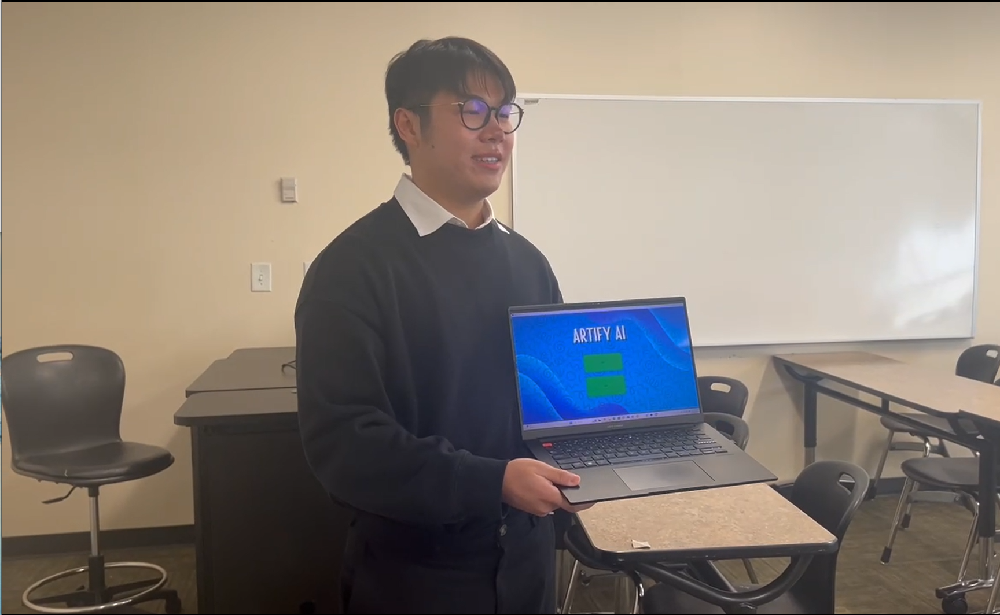
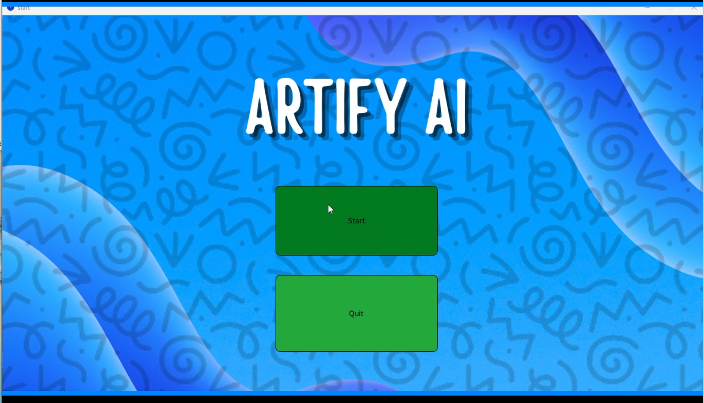

<!-- height or width of logo may be adjusted -->
<!-- This section is where you will replace the link to your transparent logo, the title of your project, and the very short desciptor of your project -->
<!-- If you used Canva to make your icon and don't want to pay for a background remover, you can use the website https://www.remove.bg/ to do so -->

  

  <h1 align="center">Artify AI (An Interactive Artistic Experience powered by AI)</h1>
  
A project for TAP by Artify AI 

<!-- the emojis are not set in stone! If you'd like you can remove them entirely or select your own from https://gist.github.com/rxaviers/7360908 you are welcome to -->

## :loudspeaker: About
The objective of the workshop is to showcase how users can turn their ideas into art with the help of Artificial Intelligence. 
<!-- You can look at other TAP projects if you need a better idea of how to describe your workshops objectives -->

This interactive workshop allows participants to explore the combination of creativity, AI, and programming through art. Using tools like Processing, Java, and DALL-E, participants create personalized images based on their input and then color and design their ideas on an interactive canvas.

## :bulb: Project Information
<!-- 
Your Options for target audience: 
  - High School
  - College
  - Middle School
  - K-12
  - Non-Stem
  - Undergraduate
You can select from a range of audiences or a single auidience. Examples: 
    Middle School - College 
    High School - College
    K-12
  You will be presenting most often to your peers who are taking introductory technology classes, so more often than not you should be including college in your target audience range. 
-->
* <b>Difficulty Level:</b> Beginner
* <b>Target Audience:</b> All Ages
* <b>Duration of Workshop:</b> 45-65 Minutes
* <b>Needed Materials:</b> A computer with keyboard, mouse, and internet connectivity
* <b>Learning Outcomes:</b>
  - The primary goal of this project is to teach participants how to combine creativity with technology.
  - Students will learn how to craft effective prompts to guide AI and experiment with different ways of structuring their prompts.
  - Students will learn how to create and manipulate colors digitally using the RGB model.
* <b>Main Technology:</b> Java and AI. 
* [Technology Ambassador Program](https://tapggc.org/) <b>(TAP)</b> is a project-based class that provides a collaborative environment for students to work with their fellow classmates on a semester-long project using technologies of their choice. TAP strives to increase participation in IT through numerous outreach activities and workshops that are designed to showcase the creative and fun side of technology.
<!-- Commercial Video stored in the Media folder will be linked here -->
 ### Commercial Video 
Click the image below to watch a 30 second commercial for the project    

<!-- videos can also be dragged and dropped into markdown files if you want them embedded -->

## :pencil2: Team: Artify AI

<!-- Use the team photo of your choice once youve uploaded it to the team photo folder within the media folder -->

> (From left to right: Francis,  Claudio, and Maggie.)

* Claudio Sandrio
* Francis Bolay
* Magaly Guillen

## :mortar_board: Advisors
<!-- name of the two professors overseeing your TAP class -->
* Dr. Cengiz Gunay
* Dr. Cindy Robertson

## :page_with_curl: Project Description
Artify AI is an interactive digital art platform powered by generative AI, designed to make digital art accessible to users of all skill levels. By entering text prompts, users can generate AI-assisted images, experiment with RGB color theory, and personalize their artwork. The platform encourages creativity through features like RGB customization, brush size control, and AI-generated templates, allowing users to explore artistic expression and fundamental computing concepts. A key focus of Artify AI is demonstrating how AI can be used creatively, with prompt engineering playing a crucial role in guiding the AI to generate specific, high-quality artistic results. Users learn how the wording and structure of prompts impact the final output, showcasing AI's potential for creative tasks. Artify AI has been showcased at several events, including the Atlanta Science Festival and TAP Expo, where it received valuable feedback from participants. These experiences highlight the importance of integrating AI education into creative and technical learning environments. Moving forward, workshops will be conducted in ITEC classes at Georgia Gwinnett College, where students can practice prompt engineering and explore digital color manipulation. These sessions aim to assess how AI tools can enhance creativity and technological literacy, helping students refine their artistic and technical skills.

## :memo: Publications
<!-- team members, then professors/advisors. "Name of Publication", event, month and day, year, Georgia Gwinnett College. -->
STARS, 17, April, 2025
and CREATE Symposium, 24, April, 2025
## :open_hands: Outreach

 February 25th, 2025 - TAP EXPO 

 
   March 15th, 2025 - Georgia Gwinnett College Atlanta Science Festival 

  
  March 22nd, 2025 - Atlanta Science Festival-Piedmont Park 

## :mag_right: Similar Projects
<i>Blending Reality (Teaching 3D modelling and Augmented Reality with Blender and Aero)https://tapggc.org/projects/2024/spring/blending-reality/ </i>

## :computer: Technology
<!-- be sure to use the alt text feature in case anybody viewing your repo is using  screen reader! you want your workshop to be as accessible as possible -->

* [Processing](https://processing.org/) uses Java’s programming language and is used for making visuals and interactive graphics .

<a href="https://openai.com/index/dall-e/">DALL-E AI</a>
An AI model that generates images from textual descriptions. It will be used to create art templates based on participant-provided prompts.

Why we chose Processing: It is easy to use and helps participants create interactive and visual art while learning programming concepts. This makes it ideal for engaging participants in both art and coding.

Why we chose DALL-E: It allows for fast and creative image generation based on participant prompts, making the process fun, interactive, and highly engaging.

<!-- if your project uses scratch, you can reuse any of these instructions (be sure to include CS First alternatives) -->
## Project Setup / Installation
### How to Download Processing
[Click here to view instructions](/documents/tutorial%20materials/how%20to%20download%20processing.md)

### How to Run Artify AI 
[Click here to view instructions](/documents/tutorial%20materials/how%20to%20download%20artify%20ai.md)

### Video How to Run Artify AI
Click on the image below for a video showing how to setup Artify AI step-by-step

## Usage
TBD

## Short Demo 
Click the image below to watch the demo of the project   
 

<b>Instructions:</b> 
1. Click the right arrow button to run the program.
2. Click the "Start" button to go to the prompt screen.
3. Write a prompt describing what you want to draw and click the "Generate" button.
4. The program will send your prompt to DALL·E, which will then return the generated image.
5. Start drawing by moving your mouse inside the canvas and click to apply the selected color.
6. Modify the brush size and color by typing the desired values in the input boxes and clicking the button.

## Workshop Instructions 
1. Introduction: We’ll start by introducing ourselves and explaining our roles in the Artify AI project. We’ll give a brief overview of the platform, highlighting its key features like prompt engineering and RGB color manipulation.

2. Pre-Survey: We’ll then distribute a pre-survey to gauge your understanding of digital art and AI before we dive into the session.

3. Presentation: We’ll present a few slides to walk you through how Artify AI works and how prompt engineering helps guide the AI to create specific images. There will be trivia questions throughout to keep things interactive.

4. Hands-On Instructions: After the presentation, we’ll show you how to access Artify AI and guide you through the platform. You’ll either complete some challenges or have free time to experiment with the tool.

5. Post-Survey: Once you’ve explored Artify AI, we’ll hand out a post-survey to gather feedback on your experience and what you learned.

6. Closing: Lastly, we’ll thank you for your time and participation, and encourage you to keep experimenting with Artify AI. We’ll also inform you about any future workshops or opportunities.

