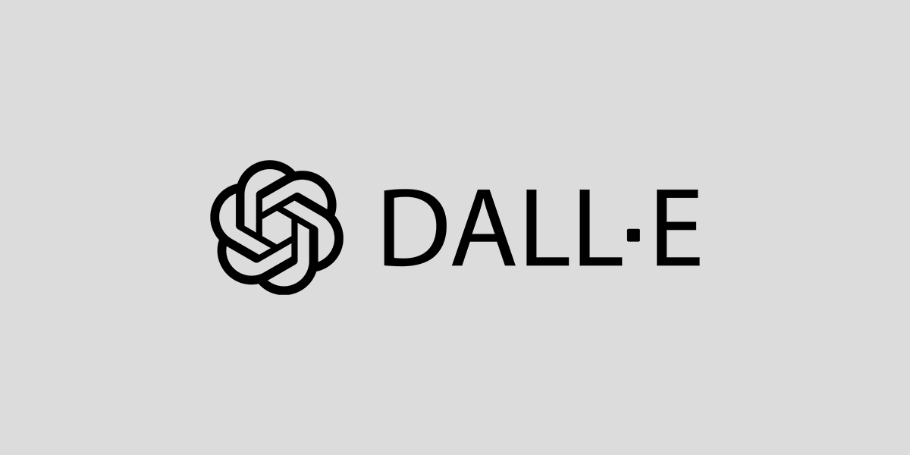

<!-- height or width of logo may be adjusted -->
<!-- This section is where you will replace the link to your transparent logo, the title of your project, and the very short desciptor of your project -->
<!-- If you used Canva to make your icon and don't want to pay for a background remover, you can use the website https://www.remove.bg/ to do so -->

  

  <h1 align="center">Artify AI (An Interactive Artistic Experience powered by AI)</h1>
  
A project for TAP by Artify AI 

<!-- the emojis are not set in stone! If you'd like you can remove them entirely or select your own from https://gist.github.com/rxaviers/7360908 you are welcome to -->

## :loudspeaker: About
The objective of the workshop is to showcase how users can turn their ideas into art with the help of Artificial Intelligence. 
<!-- You can look at other TAP projects if you need a better idea of how to describe your workshops objectives -->

This interactive workshop allows participants to explore the combination of creativity, AI, and programming through art. Using tools like Processing, Java, and DALL-E, participants create personalized images based on their input and then color and design their ideas on an interactive canvas.

## :bulb: Project Information
<!-- 
Your Options for target audience: 
  - High School
  - College
  - Middle School
  - K-12
  - Non-Stem
  - Undergraduate
You can select from a range of audiences or a single auidience. Examples: 
    Middle School - College 
    High School - College
    K-12
  You will be presenting most often to your peers who are taking introductory technology classes, so more often than not you should be including college in your target audience range. 
-->
* <b>Difficulty Level:</b> Beginner
* <b>Target Audience:</b> 10+, Artists and Designers, Teenagers, STEAM or Non-STEM major
* <b>Duration of Workshop:</b> 45-65 Minutes
* <b>Needed Materials:</b> A computer with keyboard, mouse, and internet connectivity
* <b>Learning Outcomes:</b>
  - The primary goal of this project is to teach participants how to combine creativity with technology.
  - Students will learn how to craft effective prompts to guide AI and experiment with different ways of structuring their prompts.
  - Students will learn how to create and manipulate colors digitally using the RGB model.
* <b>Main Technology:</b> Java and AI. 
* [Technology Ambassador Program](https://tapggc.org/) <b>(TAP)</b> is a project-based class that provides a collaborative environment for students to work with their fellow classmates on a semester-long project using technologies of their choice. TAP strives to increase participation in IT through numerous outreach activities and workshops that are designed to showcase the creative and fun side of technology.
<!-- Commercial Video stored in the Media folder will be linked here -->

  <b>Commercial Video</b>    
  

<!-- videos can also be dragged and dropped into markdown files if you want them embedded -->

## :pencil2: Team: Artify AI

<!-- Use the team photo of your choice once youve uploaded it to the team photo folder within the media folder -->

  

> (From left to right: Francis,  Claudio, and Maggie.)

* Claudio Sandrio
* Francis Bolay
* Magaly Guillen

## :mortar_board: Advisors
<!-- name of the two professors overseeing your TAP class -->
* Dr. Cengiz Gunay
* Dr. Cindy Robertson

## :page_with_curl: Project Description
Artify AI, an interactive digital art platform powered by generative AI. The project allows users to create and personalize artwork by simply entering text prompts, which the AI then translates into detailed outlines for coloring. This platform encourage creativity and accessibility, enabling users to engage in digital art, regardless of their skill level, from beginners with no experience but creativity, to professionals. Through RGB customization, brush size control, and AI-generated templates, Artify AI introduces users to both artistic expression and fundamental computing concepts.

## :memo: Publications
<!-- team members, then professors/advisors. "Name of Publication", event, month and day, year, Georgia Gwinnett College. -->
TBD  

## :open_hands: Outreach
<i> February 25th, 2025 - TAP EXPO
    March 15th, 2025 - Georgia Gwinnett College Atlanta Science Festival 
    March 22nd, 2025 - Atlanta Science Festival-Piedmont Park </i>

## :mag_right: Similar Projects
<i>Blending Reality (Teaching 3D modelling and Augmented Reality with Blender and Aero)https://tapggc.org/projects/2024/spring/blending-reality/ </i>

## :computer: Technology
<!-- be sure to use the alt text feature in case anybody viewing your repo is using  screen reader! you want your workshop to be as accessible as possible -->

  

* [Processing](https://processing.org/) uses Java’s programming language and is used for making visuals and interactive graphics .

  

<a href="https://openai.com/index/dall-e/">DALL-E AI</a>
An AI model that generates images from textual descriptions. It will be used to create art templates based on participant-provided prompts.

Why we chose Processing: It is easy to use and helps participants create interactive and visual art while learning programming concepts. This makes it ideal for engaging participants in both art and coding.

Why we chose DALL-E: It allows for fast and creative image generation based on participant prompts, making the process fun, interactive, and highly engaging.

<!-- if your project uses scratch, you can reuse any of these instructions (be sure to include CS First alternatives) -->
## Project Setup / Installation
### Download Processing
[Click here to view instructions](/documents/tutorial/How%20to%20download%20Processing.md)

### Getting to the System 
TBD

## Usage
TBD

## Short Demo Instructions 
1. Click the right arrow button to run the program.
2. Click the "Start" button to go to the prompt screen.
3. Write a prompt describing what you want to draw and click the "Generate" button.
4. The program will send your prompt to DALL·E, which will then return the generated image.
5. Start drawing by moving your mouse inside the canvas and click to apply the selected color.
6. Modify the brush size and color by typing the desired values in the input boxes and clicking the button.

## Workshop Instructions 
TBD

