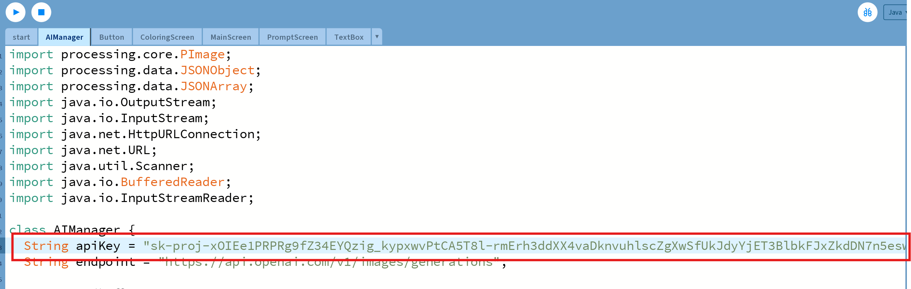

1. Download the Artify AI zip folder.
 
2. Once the file is finished downloading, go to your download folder. Click on the file and extract the ZIP file.
 
3. Click the start.pde file and open it with processing.
   
   

4. You need to get the API key from OPENAI and put it in the 'AI Manager" class ""
   
   
5. Click the run button on top left.
   
   
   
6. Click the start button.
   
   
   
7. Write a prompt describing what you want to draw and click the "Generate" button.
    
   
   
8. Start drawing by moving your mouse inside the canvas and click to apply the selected color.
    
   
   
9. Modify the brush size and color by typing the desired values in the input boxes and clicking the button.
